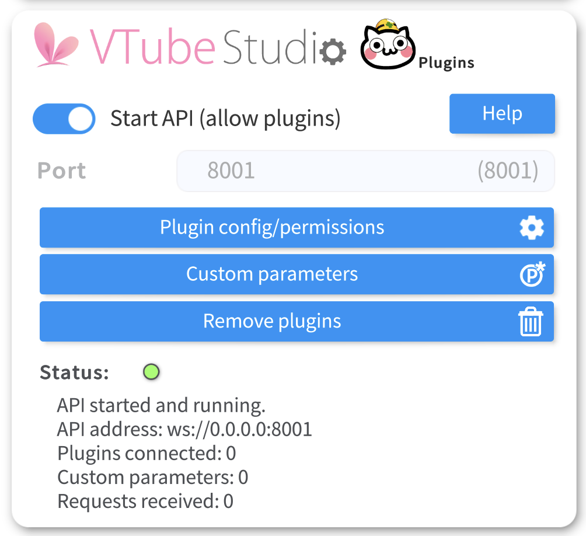
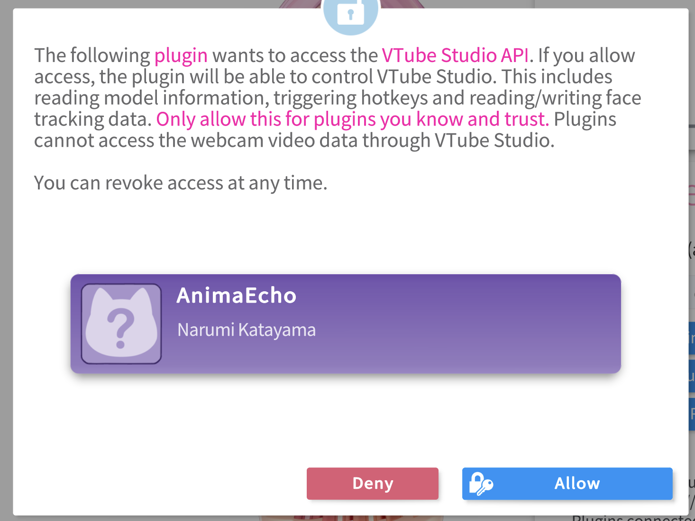
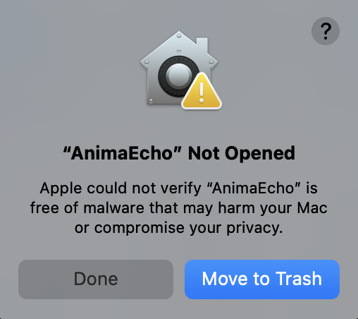
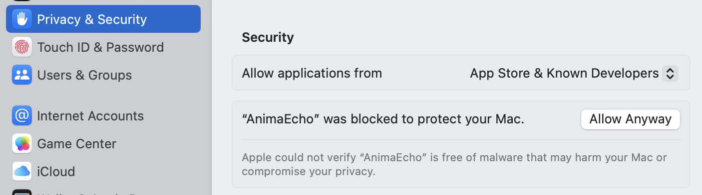
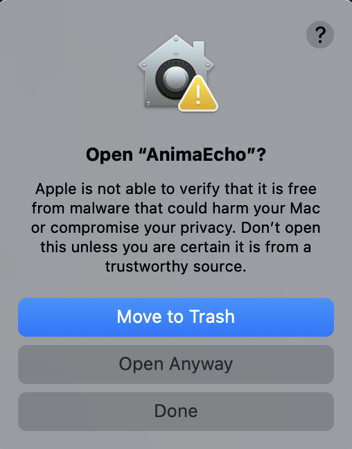

# AnimaEcho Plugin

AnimaEcho is a VTube Studio integration plugin that enables voice interaction with AI, allowing your avatar to respond in real-time using text-to-speech and lip sync animation.

---

1. [Requirements](#requirements)
2. [How It Works](#how-it-works)
3. [Installation Guide (For Non-Developers)](#installation-guide-for-non-developers)
    * [Option 1 (executable file)](#option-1-executable-file)
    * [Option 2 (Automatic Virtual  Environment)](#option-2-automatic-virtual-environment)
4. [Installation Guide (For Developers)](#installation-guide-for-developers)
5. [Usage](#usage)
6. [Troubleshooting](#troubleshooting)

### Requirements
* VTube Studio must be running with the **WebSocket API enabled**.
  

* Grant permission to the plugin **when prompted in VTube Studio**.
  

--- 

### How It Works

1. Records your voice using a microphone for **5 seconds**.
2. Sends the recorded audio to the AnimaEcho API.
3. Receives an AI-generated voice response in return.
4. Plays the AI-generated response in VTube Studio.
5. Syncs lip movements to match the response.

---

##  Installation Guide (For Non-Developers)

## Option 1 (executable file)

Follow these simple steps to use AnimaEcho without any coding.

* **Download and extract the ZIP file.**
* Navigate to the `run/` Folder
* Run the Plugin

#### Windows
* Double-click on the `AnimaEcho.exe` file inside the `run/Windows` folder.

#### macOS/Linux
* On terminal navigate to the `run/macOS_Linux` folder, and run:
    ```bash
    ./AnimaEcho
    ```

### Troubleshooting for Executable File

When running the AnimaEcho executable file, you may encounter security warnings or execution issues on macOS. Below are the common problems and their solutions:
#### **macOS Security Warnings**

* **Problem:**  
When trying to run the executable, you see the message:  
> `"AnimaEcho" Not Opened`



### Solution:

1. Open **System Preferences > Privacy & Security**.
2. Under the **General** tab, click **Allow Anyway** next to the blocked app warning.
  > "AnimaEcho" was blocked to protect your Mac.


  
3. Run the executable again `./AnimaEcho`, and confirm if prompted `Open Anyway`.



### How It Works

* Each time you want to send audio to VTube Studio, you need to execute the file (double-click on windows) or run the command above (macOS/Linux).
* The plugin will:
    - Start recording audio for **5 seconds**.
    - Send the recorded audio to the **AnimaEcho API**.
    - Play back the AI-generated response and synchronize it with your VTube Studio avatar.

## Option 2 (Automatic Virtual Environment)
Install the plugin without conflicts in the system, create an automatic installation script with a virtual environment.

### Requirements for Option 2:
- Python 3.7 or later must be installed on your system.
- Ensure that the `python3` command is available in your terminal.
- **Pip:** The package manager **pip** is also required to install the dependencies listed in the requirements.txt file and the plugin.

If you do not have Python installed, consider using **Option 1 (Executable File)**, which does not require Python.

### Windows
* Double-click on `install_animaecho.bat` file inside `run/Windows` folder.

### macOS/Linux

1. Navigate to the folder where the script is saved and run the script.

```bash
cd run/macOS_Linux
chmod +x install_animaecho.sh
./install_animaecho.sh
```

2. The script create a virtual environment `(animaecho_env)`, activate it before running AnimaEcho

```bash
source animaecho_env/bin/activate
```

3. Run the command below within the virtual environment

```bash
animaecho
```
* Each time you want to send audio to VTube Studio, you need to run the `animaecho` command.
* The plugin will:
  - Start recording audio for **5 seconds.**
  - Send the recorded audio to the **AnimaEcho API.**
  - Play back the AI-generated response and synchronize it with your VTube Studio avatar.

4. Follow the instructions in the terminal:
    - The terminal will display instructions and feedback as the plugin runs.
    - Ensure VTube Studio is running with the **WebSocket API enabled**, and grant permissions when prompted.
___

5. To exit the Python virtual environment, run the command:

```bash
deactivate
```

## Installation Guide (For Developers)

1. Remove previous versions (if installed)
    ```bash
    pip uninstall animaecho-plugin -y
    ```
   
2. Recreate and build the package
    ```bash
    python animaecho_plugin/setup.py sdist bdist_wheel
    ```
3. Install the plugin
    ```bash
    pip install dist/animaecho_plugin-1.0-py3-none-any.whl
    ```
4.  Verify installation
    ```bash
    which animaecho  # macOS/Linux
    where animaecho  # Windows
    ```

## Usage

#### Run the plugin
```bash
animaecho
```

🎙️ The plugin will start recording audio, send it to the Anima API, and play back the response in sync with your VTube Studio avatar.

---

### Reinstalling the plugin

If you need to reinstall the plugin, use:

```bash
pip install --force-reinstall dist/animaecho_plugin-1.0-py3-none-any.whl
```

---

## Troubleshooting

#### If you encounter issues, check the following:
- Ensure **VTube Studio** is running and the WebSocket API is **enabled**.
- Verify that the plugin has been **granted permission** in VTube Studio.
- Check the **Python environment** and ensure dependencies are installed.
- If you see an **FFmpeg error**, ensure `ffmpeg` is installed and accessible from the command line.
- Try reinstalling the plugin with:
  ```bash
    pip install --force-reinstall dist/animaecho_plugin-1.0-py3-none-any.whl
    ```